# User Management System (Spring Boot)

## Project Overview

This project is a **Spring Boot-based User Management System** designed using a **clean layered architecture**.
It demonstrates how to build a scalable backend application with proper separation of concerns, exception handling, and modular design.

The system supports **CRUD operations**, along with additional modules like **Notification Service** and **Message Formatter**, making it a complete backend practice project.

##  Objectives

* Implement RESTful APIs using Spring Boot
* Apply layered architecture (Controller → Service → Repository)
* Handle exceptions using custom exceptions and global handler
* Validate user input effectively
* Demonstrate Dependency Injection and reusable components
* Build modular and maintainable code

---

## Features

### User Management

* Create User
* Retrieve All Users
* Retrieve User by ID
* Update User
* Delete User

### Exception Handling

* User Not Found
* Duplicate User Entry
* Invalid User Data

### Notification Module

* Sends notification response using reusable component

### Message Formatter Module

* Formats messages into:

  * Short format
  * Long format

## Architecture

The project follows **Layered Architecture**:

* **Controller Layer** → Handles HTTP requests
* **Service Layer** → Business logic
* **Repository Layer** → Data handling (in-memory)
* **Model Layer** → Entity classes
* **Component Layer** → Reusable logic
* **Exception Layer** → Custom exceptions

## Tech Stack

* Java
* Spring Boot
* Maven
* Thunder Client (API Testing)

##  Project Structure

The project is organized under the base package:

`com.example.usermanagementsystem`

It includes the following packages:

- controller  
- service  
- repository  
- model  
- component  
- exception  

## API Endpoints

### User APIs

This module handles all user-related operations such as creating, retrieving, updating, and deleting users.

- **Get All Users**  
  Endpoint: `/users`  
  Returns a list of all users.

- **Get User by ID**  
  Endpoint: `/users/{id}`  
  Returns details of a specific user.

- **Add User**  
  Endpoint: `/users`  
  Method: POST  
  Adds a new user after validating input.

- **Update User**  
  Endpoint: `/users/{id}`  
  Method: PUT  
  Updates user details based on ID.

- **Delete User**  
  Endpoint: `/users/{id}`  
  Method: DELETE  
  Deletes a user if the ID exists.

### Notification API

This module is responsible for sending notifications using a reusable component.

- **Send Notification**  
  Endpoint: `/notification`  
  Returns a success message indicating that the notification has been sent.

### Formatter API

The formatter module is used to format messages based on the selected type.

- **Short Format**  
  Endpoint: `/formatter?message=Hello&type=short`  
  Returns a short formatted message.

- **Long Format**  
  Endpoint: `/formatter?message=Hello&type=long`  
  Returns a detailed formatted message.

## API Testing (Thunder Client)

### Get All Users

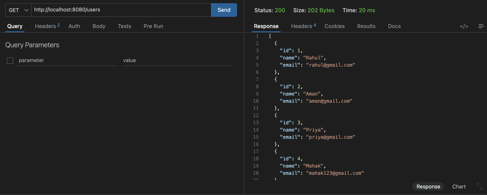

### Add User

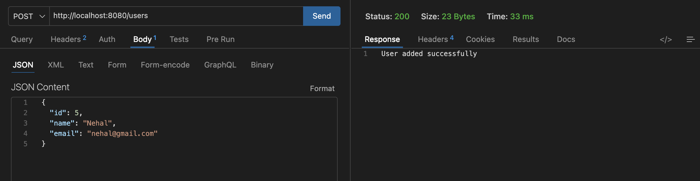

### Verify Added User

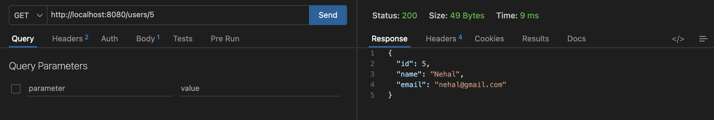

### Update User

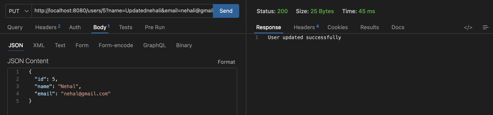

### Verify Updated User

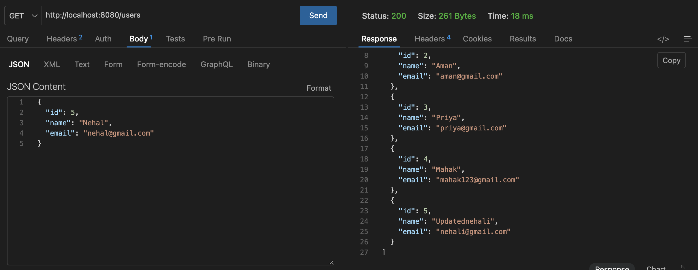

### Delete User

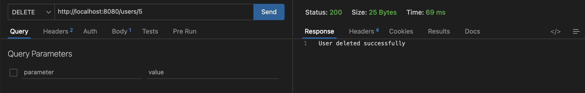

### Exception Handling (User Not Found)

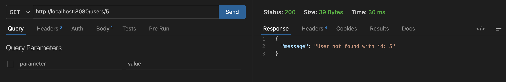

### Validation (Invalid User Data)

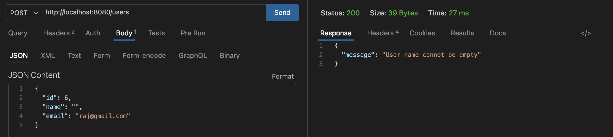

### Notification API

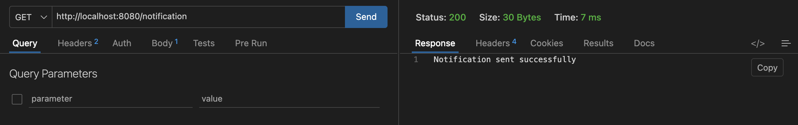

### Formatter - Short Message

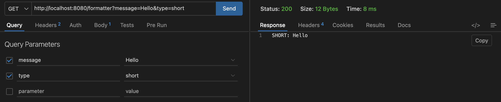

### Formatter - Long Message

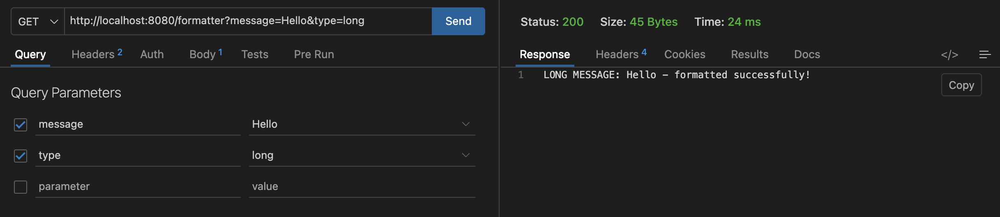

## ⚙️ How to Run the Project

1. Clone the repository
2. Open in IDE (VS Code / IntelliJ)
3. Run the application using:

- If Maven is installed:
  mvn spring-boot:run

- Or using Maven Wrapper:
  ./mvnw spring-boot:run

4. Test APIs using Thunder Client or Postman

##  Key Concepts Used

* Dependency Injection
* Separation of Concerns
* REST API Design
* Exception Handling
* Modular Architecture
* Clean Code Practices

##  Conclusion

This project demonstrates how to design a **well-structured backend system** using Spring Boot.
It focuses on **clean architecture, maintainability, and real-world coding practices**, making it a strong foundational project for backend development.

## Author

**Mahak Dhanotiya**
