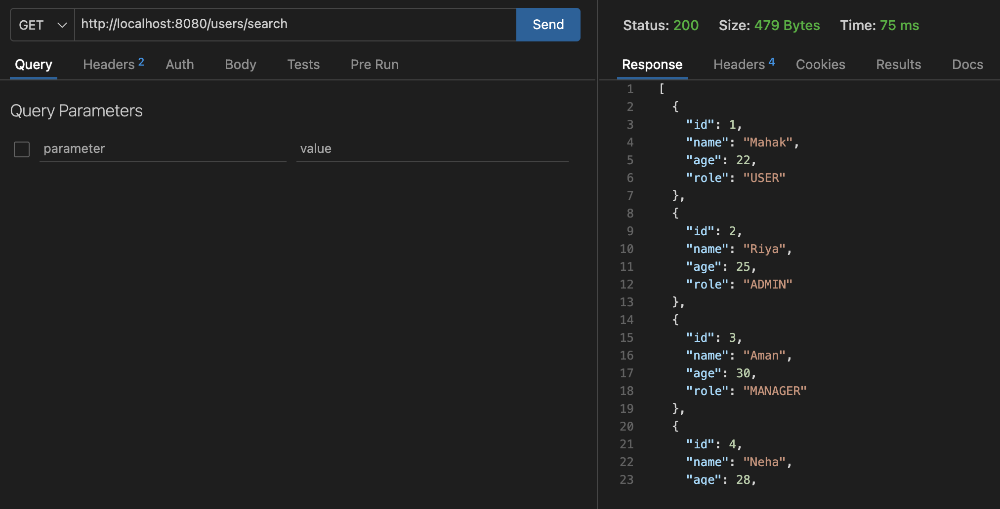
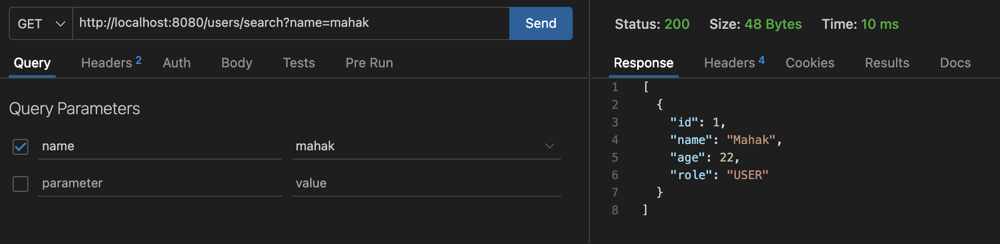
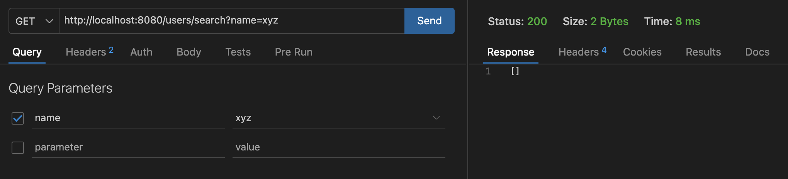
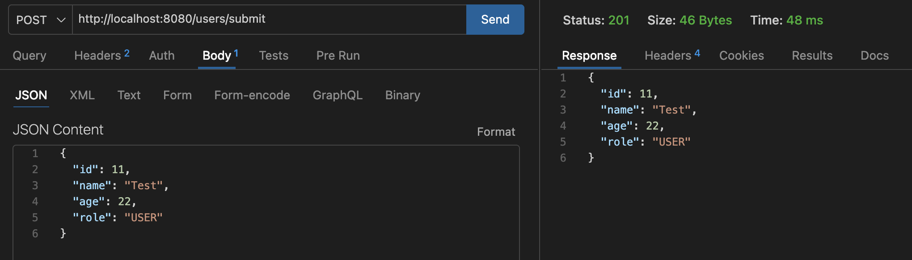
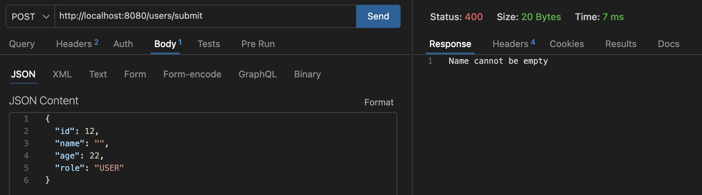
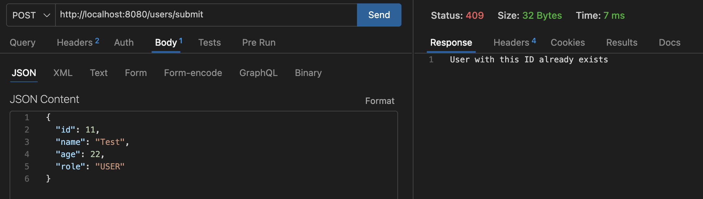
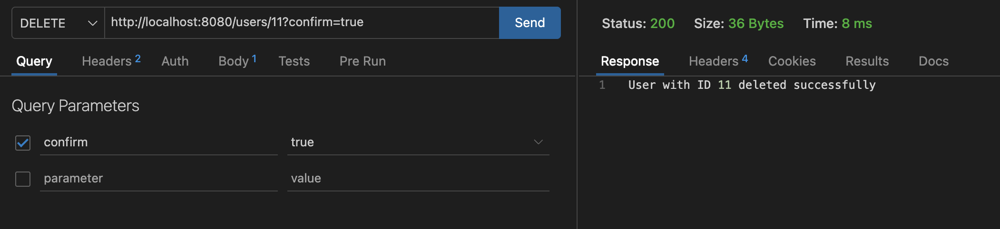
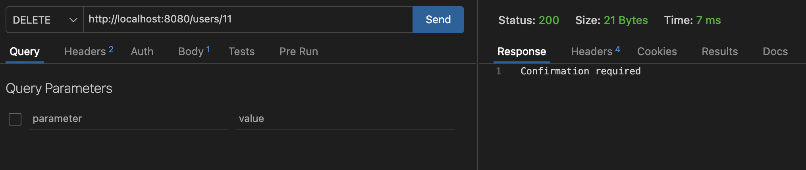
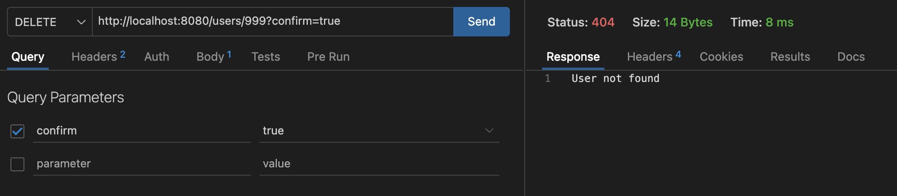

# User Search System (Spring Boot)

## Overview
This project is a RESTful API built using Spring Boot as part of a training assignment.

It manages user data using an in-memory list and provides functionalities to search, add, and delete users.  
The project focuses on implementing clean architecture, proper validation, and structured exception handling.

---

## Architecture

The project follows a layered architecture to ensure separation of concerns:

Model → Repository → Service → Controller → Exception

### Model Layer
Represents the data structure of the application.
- Contains the `User` class
- Defines fields like id, name, age, and role

###  Repository Layer
Handles data storage.
- Uses an in-memory list to store users
- Acts as a data source (no database used)

###  Service Layer
Contains business logic.
- Validates user input
- Applies filtering logic for search
- Handles delete confirmation logic
- Throws custom exceptions

### Controller Layer
Handles API requests and responses.
- Maps HTTP requests to service methods
- Returns appropriate HTTP responses

###  Exception Layer
Handles errors globally.
- Custom exceptions:
  - InvalidUserException
  - UserNotFoundException
  - UserAlreadyExistsException
- GlobalExceptionHandler using @RestControllerAdvice

---

## Features

- Search users using multiple filters (name, age, role)
- Case-insensitive search for name and role
- Add users with validation checks
- Delete users with confirmation parameter
- Custom exception handling
- Global exception handling
- Proper HTTP status codes
- Clean and maintainable code

---

## Tech Stack

- Java 17
- Spring Boot
- Maven
- REST APIs

---

## How to Run the Project

1. Clone the repository
2. Open the project in IntelliJ IDEA or VS Code
3. Make sure Java 17 is installed
4. Run the main Spring Boot application
5. The server will start on: http://localhost:8080
6. Use Postman or Thunder Client to test APIs

---

## API Endpoints

### 1. Search Users
GET /users/search

#### Query Parameters (optional)
- name (String)
- age (Integer)
- role (String)

#### Behavior
- No parameters → returns all users
- With parameters → filters users
- Case-insensitive matching for name and role
- Exact matching for age

---

###  2. Add User
POST /users/submit

#### Request Body
{
   "id": 1,
   "name": "Mahak",
   "age": 22,
   "role": "USER"
}

#### Responses
- 201 → User added successfully
- 400 → Invalid input

---

###  3. Delete User
DELETE /users/{id}?confirm=true

#### Behavior
- confirm=true → deletes user
- confirm=false or missing → "Confirmation required"

---

## Exception Handling

| Exception | Status Code | Description |
|----------|------------|------------|
| InvalidUserException | 400 | Invalid input |
| UserNotFoundException | 404 | User not found |
| UserAlreadyExistsException | 409 | Duplicate user |

---

## Project Structure

user-search-system/
│
├── src/
│   └── main/
│       └── java/
│           └── com/
│               └── example/
│                   └── user_search_system/
│                       ├── controller/
│                       │   └── UserController.java
│                       │
│                       ├── service/
│                       │   └── UserService.java
│                       │
│                       ├── repository/
│                       │   └── UserRepository.java
│                       │
│                       ├── model/
│                       │   └── User.java
│                       │
│                       └── exception/
│                           ├── InvalidUserException.java
│                           ├── UserNotFoundException.java
│                           ├── UserAlreadyExistsException.java
│                           └── GlobalExceptionHandler.java
│
├── src/main/resources/
│   └── application.properties
│
├── screenshots/
│   └── (API testing screenshots)
│
├── pom.xml
└── README.md

---

## Testing APIs

### Get All Users

### Search By Name

### Search No Result

### Add User Success

### Invalid User Input

### Duplicate User

### Delete Success

### Delete Without Confirmation

### Delete Not Found

---

## Enhancements

- Case-insensitive search
- Sorted search results by ID
- Improved delete response message
- Comprehensive testing with edge cases

---

## Key Concepts Used

- Dependency Injection (Constructor-based)
- Inversion of Control (IoC)
- Layered Architecture
- REST API Design
- Exception Handling using @ControllerAdvice
- Java Streams for filtering

---

## Conclusion

This project demonstrates a strong understanding of Spring Boot fundamentals, including layered architecture, dependency injection, REST API design, and exception handling.
It follows clean coding practices and successfully fulfills all assignment requirements.

## Author

Mahak Dhanotiya
