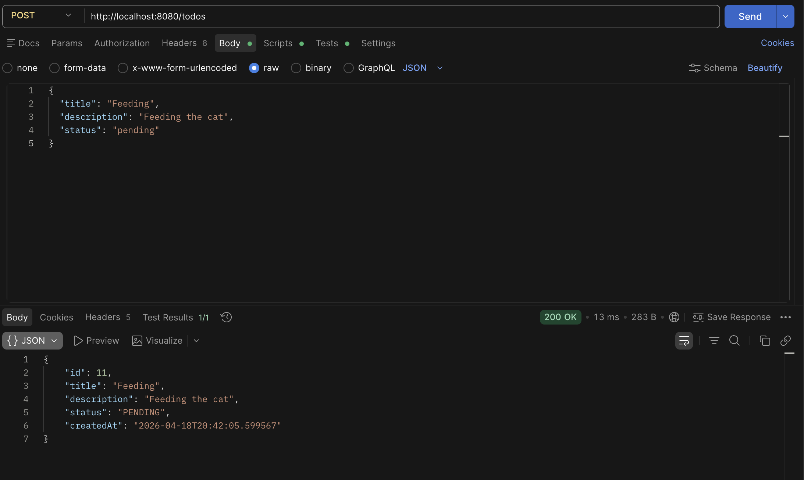
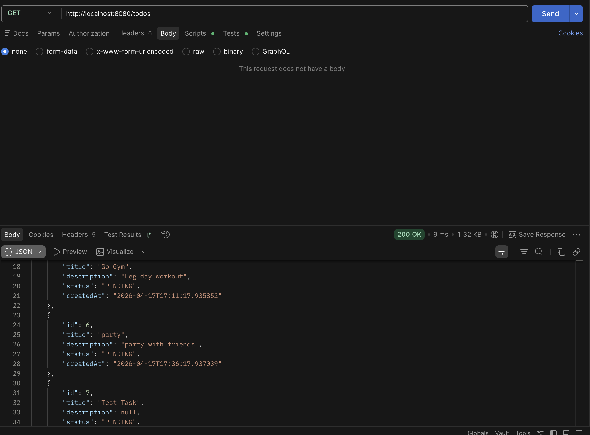
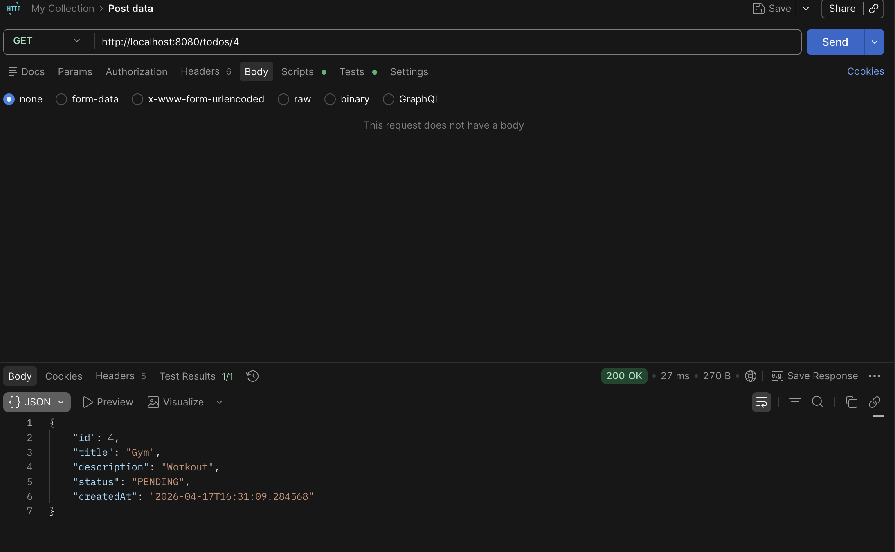
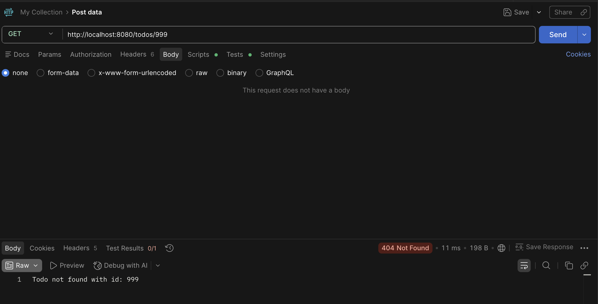
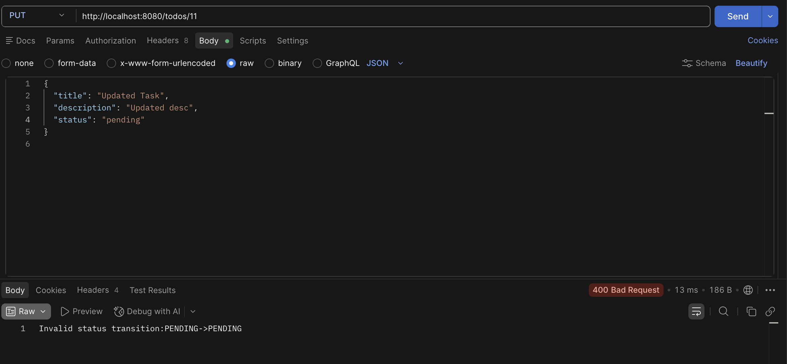
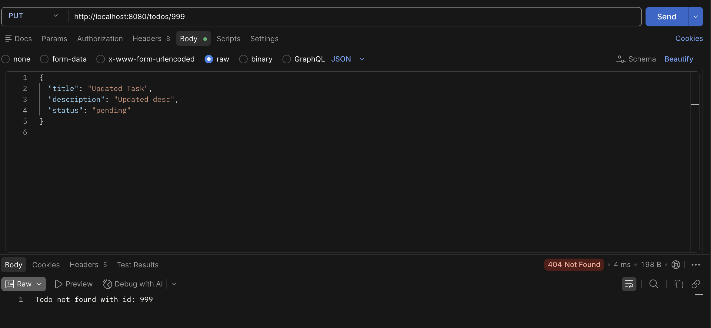
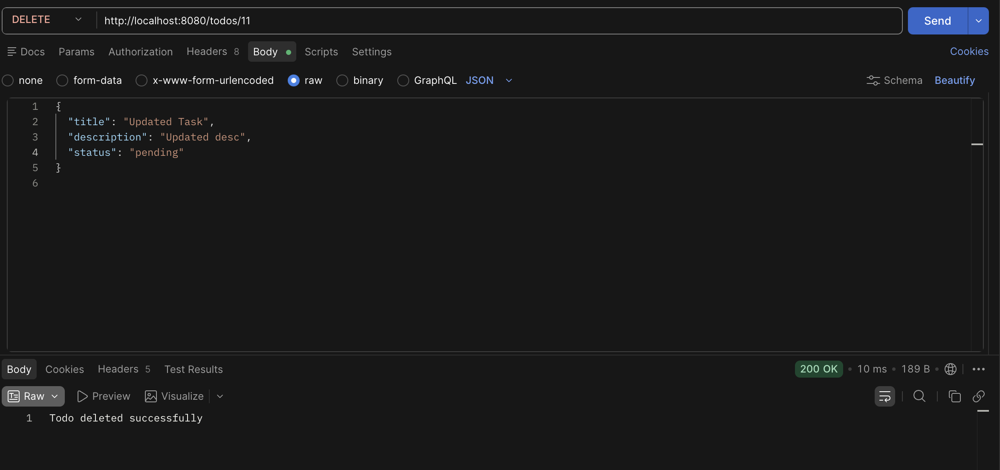
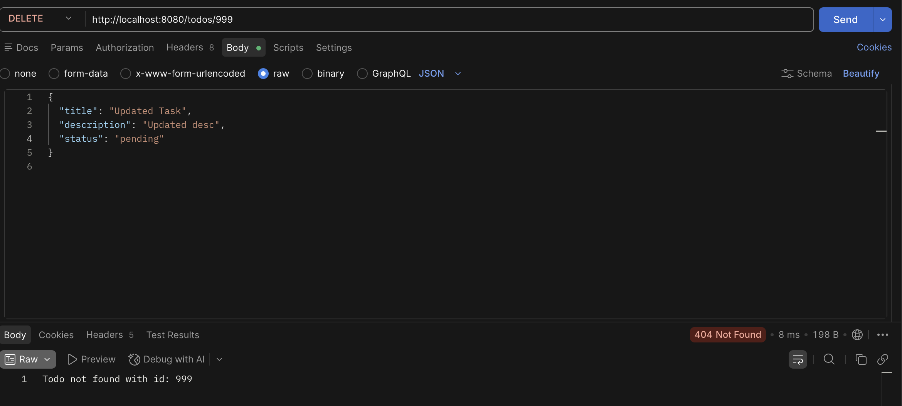
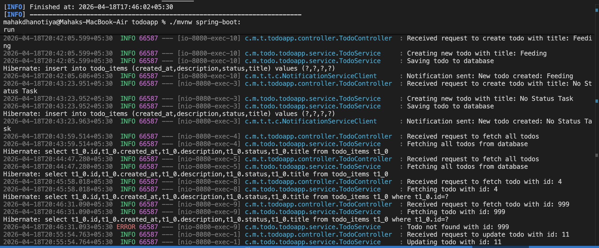

# Todo Management REST API

A well-structured Spring Boot REST API for managing Todo tasks.
This project demonstrates CRUD operations, validation logic, clean architecture, and logging for debugging and traceability.
The API follows RESTful principles and returns appropriate HTTP status codes.

---

# Project Overview

This application allows users to create, retrieve, update, and delete Todo items.
It follows a layered architecture and includes business logic validation to ensure data consistency.

The project also demonstrates:

* Proper HTTP status handling
* Exception management
* Logging for request tracing
* DTO-based architecture

---

# Features

* Create Todo
* Retrieve all Todos
* Retrieve Todo by ID
* Update Todo
* Delete Todo
* Default status handling (PENDING)
* Status transition validation
* Logging for internal flow tracking

---

# Tech Stack

* Java
* Spring Boot
* Spring Web
* Spring Data JPA
* PostgreSQL
* Postman

---

# Base URL

http://localhost:8080

---

# API Endpoints

## Create Todo

POST /todos

Request Body:

```json
{
  "title": "Feeding",
  "description": "Feeding the cat",
  "status": "pending"
}
```

Behavior:

* If status is not provided, it defaults to PENDING
* Returns created Todo with status and timestamp

---

## Get All Todos

GET /todos

Behavior:

* Returns list of all stored todos
* Response status: 200 OK

---

## Get Todo by ID

GET /todos/{id}

Success:

* 200 OK

Failure:

* 404 Not Found
* Message: Todo not found with id: {id}

---

## Update Todo

PUT /todos/{id}

Request Body:

```json
{
  "title": "Updated Task",
  "description": "Updated desc",
  "status": "completed"
}
```

Success:

* 200 OK

Failure Cases:

Invalid Status Transition:

* 400 Bad Request
* Example: PENDING → PENDING is not allowed

Todo Not Found:

* 404 Not Found

---

## Delete Todo

DELETE /todos/{id}

Success:

* 200 OK
* Todo deleted successfully

Failure:

* 404 Not Found

---

# Status Flow Validation

The application enforces strict rules for status updates:

| From    | To        | Allowed |
| ------- | --------- | ------- |
| PENDING | COMPLETED | Yes     |
| PENDING | PENDING   | No      |

This prevents unnecessary or invalid updates and ensures business rule consistency.

---

# Validation

The application uses annotation-based validation at the DTO level to ensure that incoming request data is valid before processing.

## Annotations Used

* @NotNull
* @Size

These annotations validate fields such as title and description to prevent invalid or empty data from being processed.

## How It Works

* Validation is applied on request DTOs
* The `@Valid` annotation is used in controller methods
* If validation fails, Spring automatically returns a `400 Bad Request` response

## Benefits

* Prevents invalid input data
* Reduces manual validation logic
* Ensures cleaner and more maintainable code


---

# Status Values

* PENDING
* COMPLETED

---

# Project Architecture

The application follows a layered architecture:

## Controller Layer

Handles HTTP requests and responses. It exposes REST endpoints and delegates processing to the service layer.

## Service Layer

Contains business logic and validation, including status transition rules and exception handling.

## Repository Layer

Interacts with the database using Spring Data JPA.

## Entity

Represents the database model.
The `Todo` entity maps to the database table and contains fields such as:

* id
* title
* description
* status
* createdAt

## DTO (Data Transfer Object)

Used to transfer data between layers.
Separates internal entity structure from external API contracts.

## Mapper

Handles conversion between DTO and Entity objects.
Ensures clean separation of concerns and avoids exposing entity directly.

## Component

Used for additional functionalities such as notifications and logging.

## Exception Layer

Handles custom exceptions and ensures proper HTTP responses for error scenarios.

---

## Dependency Injection

Dependency Injection is implemented using constructor-based injection.
All dependencies are injected through constructors, ensuring immutability, better testability, and adherence to Spring best practices.

# Project Structure

```
src/
 ├── controller
 ├── service
 ├── repository
 ├── entity
 ├── dto
 ├── mapper
 ├── component
 └── exception
```

---

# Logging and Internal Flow

The application uses logging to track:

* Incoming requests
* Service-level operations
* Database interactions
* Error scenarios

Logs help in debugging and understanding the execution flow.

---

## Notification Handling

A dummy NotificationServiceClient is used to simulate external service interaction.

It is triggered when a new Todo is created, logging a message:
"Notification sent for new TODO"

---

# Unit Testing

The service layer of the application is tested using JUnit and Mockito.

## Tools Used

* JUnit 5
* Mockito

## What is Tested

* Create Todo
* Get Todo by ID
* Get All Todos
* Update Todo
* Delete Todo

## Test Coverage

The tests cover both:

### 1. Successful Scenarios

* Creating a todo successfully
* Fetching existing todo
* Updating valid status transition
* Deleting existing todo

### 2. Edge Cases / Exception Handling

* Todo not found (404 scenarios)
* Invalid status transition (400 scenarios)

## Testing Approach

* Repository layer is mocked using Mockito
* Service layer is tested in isolation
* Method calls are verified using `verify()`
* Exceptions are tested using `assertThrows()`

## Key Benefits

* Ensures business logic correctness
* Prevents regression issues
* Improves code reliability

---

# Testing

All APIs are tested using Postman.

The testing includes:

* Successful CRUD operations
* Invalid status transitions
* Not found scenarios
* Default value handling

---

# Screenshots

## Create Todo (Default Status)


## Create Todo (With Status)



## Get All Todos



## Get Todo by ID (Success)



## Get Todo Not Found



## Update Todo Success


## Update Invalid Status Transition



## Update Todo Not Found



## Delete Todo Success



## Delete Todo Not Found



## Application Logs




---

# How to Run

1. Clone the repository
2. Open the project in an IDE
3. Configure database (if required)
4. Run the Spring Boot application
5. Use Postman to test the APIs

---

# Key Highlights

* Clean REST API design
* Layered architecture
* DTO-based data handling
* Business logic validation
* Proper HTTP status codes
* Exception handling
* Logging for traceability
* End-to-end API testing

---

# Author

Mahak Dhanotiya
