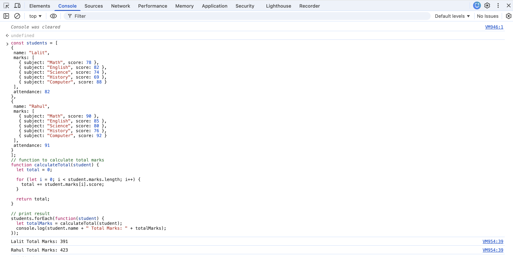
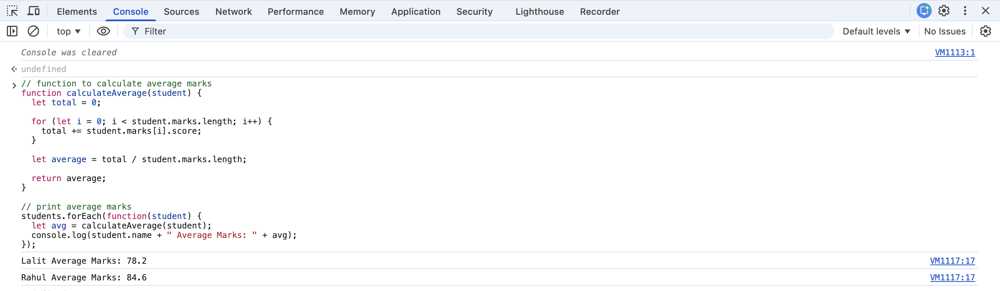
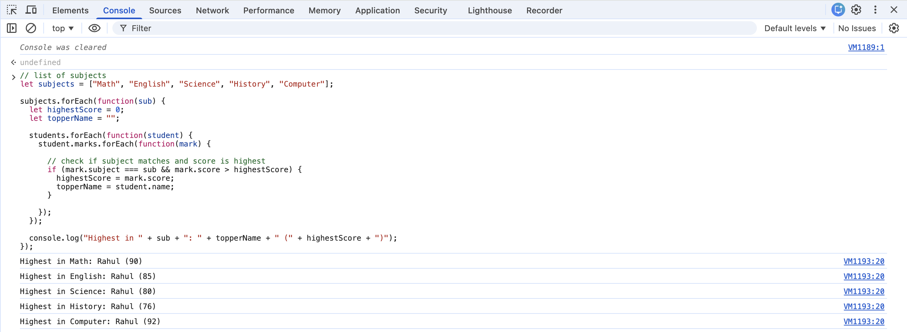
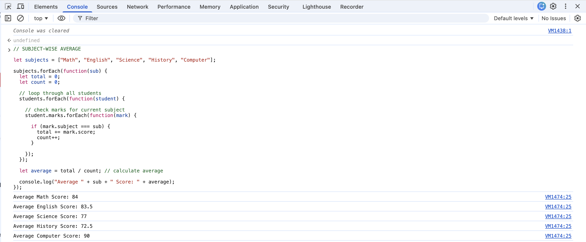
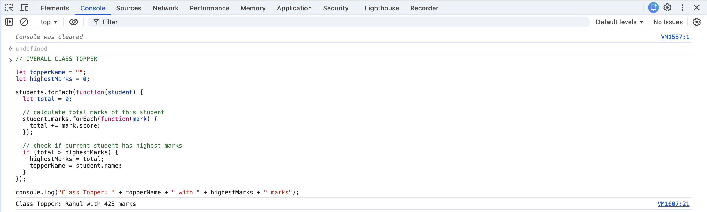
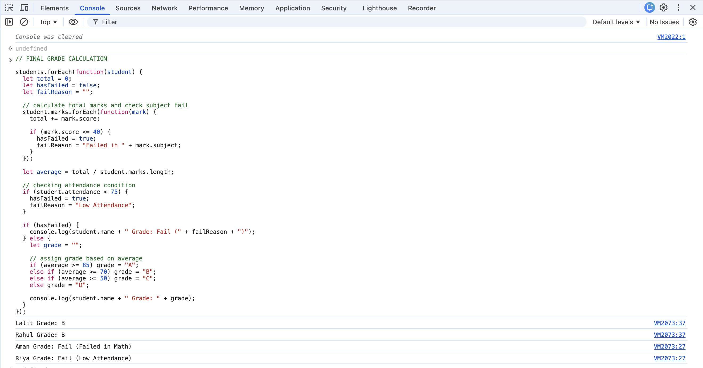

# 📊 Student Performance Analyzer (JavaScript)

## Overview

This is a console-based JavaScript application that analyzes student performance.  
It calculates total marks, average marks, subject-wise performance, and assigns grades based on conditions.

## Features

- Calculate total marks  
- Calculate average marks  
- Find subject-wise highest scores  
- Calculate subject-wise average scores  
- Determine class topper  
- Apply fail conditions (marks & attendance)  
- Assign grades based on performance  

## Concepts Used

- Arrays and Objects  
- Loops (forEach)  
- Conditional Statements (if-else)  
- Functions  
- Console Output  

## Project Structure

frontend/js/
- mahak_student_analyzer.js  
- screenshots/

## How to Run

1. Open browser  
2. Right click → Inspect  
3. Go to Console tab  
4. Paste the code  
5. Press Enter  

## Output Screenshots

### Total Marks
- Calculates total marks by adding scores of all subjects  
- Uses looping through student marks  

---

### Average Marks
- Calculates average using total marks divided by number of subjects  
- Demonstrates basic arithmetic logic  

---

### Subject-wise Highest
- Compares marks of all students for each subject  
- Identifies highest scorer using conditional logic  

---

### Subject-wise Average
- Calculates average score for each subject across students  
- Uses total and count logic  

---

### Class Topper
- Finds student with highest total marks  
- Uses comparison logic  

---

### Grade Calculation
- Applies fail conditions (marks ≤ 40 or attendance < 75)  
- Assigns grades using if-else conditions  
