# Product Inventory Dashboard

## Project Overview
- A web-based Product Inventory Dashboard built using HTML, CSS, and JavaScript
- Simulates a real-world inventory management system
- Provides an interactive UI to manage and analyze products

## Features

### Product Management
- Add new products using a form
- Form validation:
  - Product name cannot be empty
  - Price must be greater than 0
  - Stock cannot be negative
  - Category must be selected
- Each product has a unique ID
- Delete products with confirmation

### Search Functionality
- Real-time search while typing
- Case-insensitive matching
- Filters products based on name

### Filters
- Category filter:
  - Electronics
  - Clothing
  - Books
  - Accessories
- Low stock filter (stock < 5)

### Sorting
- Price: Low to High
- Price: High to Low
- Name: A to Z
- Name: Z to A

### Inventory Analytics
- Total Products
- Total Inventory Value (price × stock)
- Out of Stock Count

### Data Persistence
- Uses Local Storage
- Data remains after page refresh

### Async Loading (Simulated API)
- Data fetched using Promise and setTimeout
- Spinner loader displayed during loading
- Products rendered after delay

### Bonus Features
- Spinner loader
- Controls disabled during loading
- No products found message
- Responsive design for mobile screens

## Controls Section
- Search input for real-time filtering
- Category dropdown for filtering products
- Low stock checkbox to show limited stock items
- Sorting dropdown for ordering products

## Product Categories
- Electronics
- Clothing
- Books
- Accessories

## Key Concepts Learned
- DOM Manipulation
- Event Handling
- Local Storage usage
- Array methods (filter, sort)
- Asynchronous JavaScript (Promises)
- Responsive Design

## How It Works
- Products are fetched from Local Storage
- UI is dynamically rendered using JavaScript
- Filters and search update the displayed data in real-time
- Sorting rearranges the product list based on selected criteria

## Usage Flow
- Page loads
- Spinner loader is displayed
- fetchProducts() is called
- Data fetched after delay
- Products rendered dynamically
- Loader hidden
- User interacts with dashboard

## Technologies Used
- HTML5
- CSS3 (Flexbox + Grid)
- JavaScript (Vanilla JS)
- LocalStorage API

## Folder Structure
- mini_app/product_inventory_dashboard/
  - index.html
  - style.css
  - script.js
  - screenshots/

## Screenshots

### Initial Layout
Basic structure with header, controls, analytics, and product grid sections.
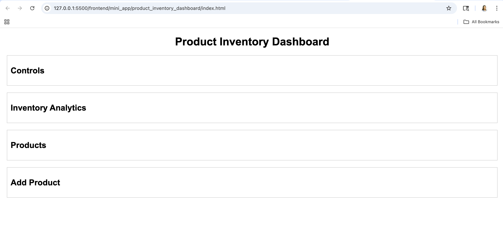

### Controls Section
Provides search, filtering, and sorting options for managing products.
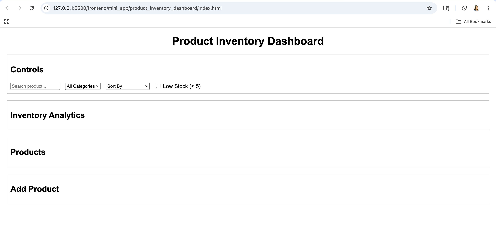

### Product UI
Displays all products in a grid layout with basic details.
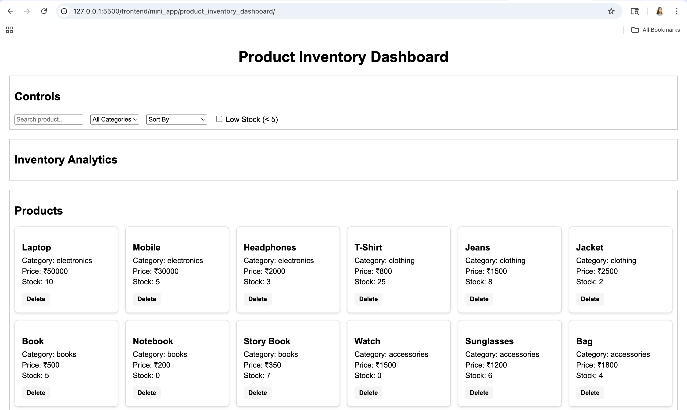

### Analytics
Displays total products, total value, and out-of-stock count.
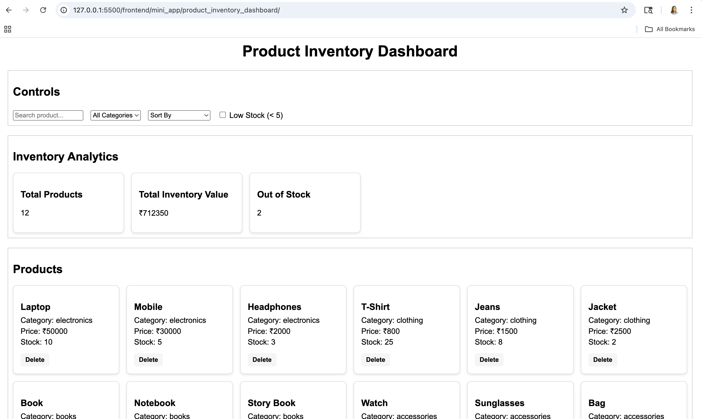

### Add Product Form
Allows users to input product details with validation.
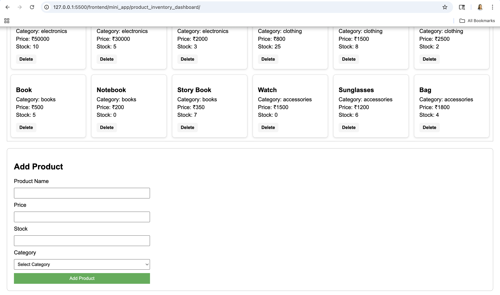

### Add Product
Adds a new product and updates inventory instantly.
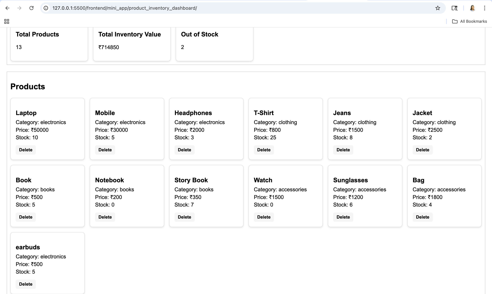

### Delete Confirmation
Displays a confirmation popup before deleting a product.
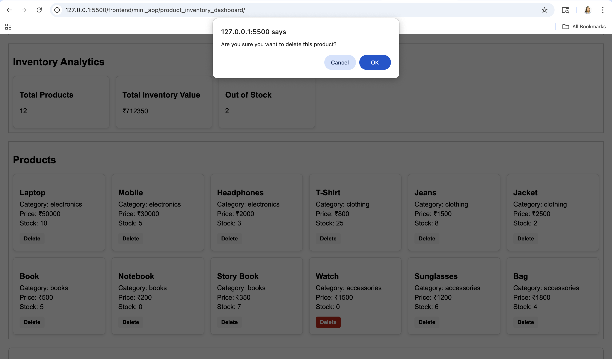

### Search Functionality
Filters products in real-time based on user input.
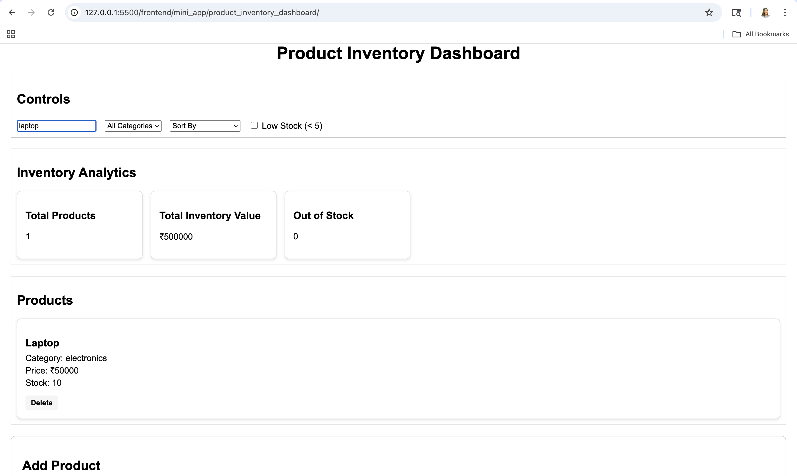

### Category Filter
Displays products based on selected category.
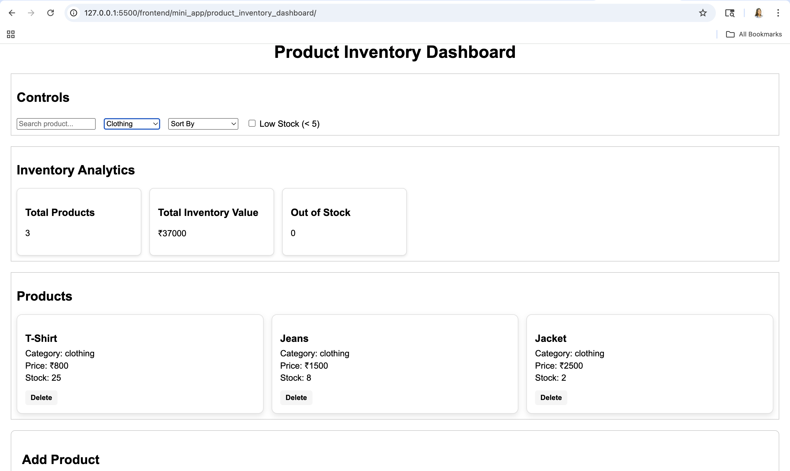

### Low Stock Filter
Shows products with stock less than 5.
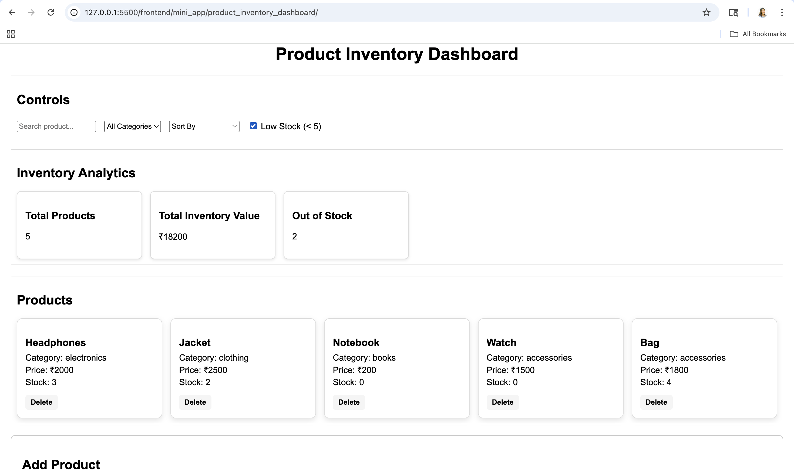

### Sorting
Sorts products by price and name in different orders.
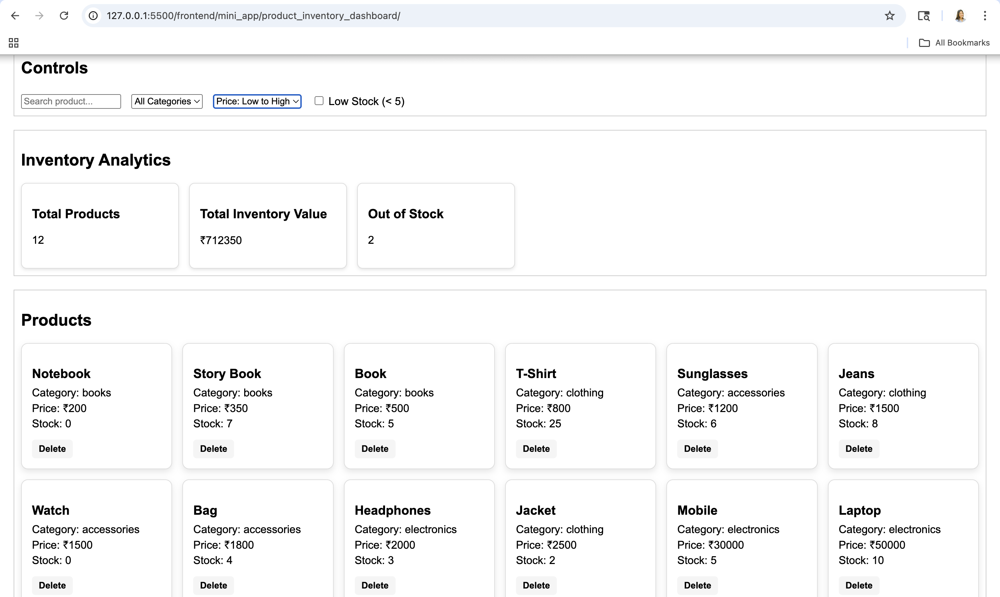

### Spinner Loading
Shows a spinner while data is being fetched.
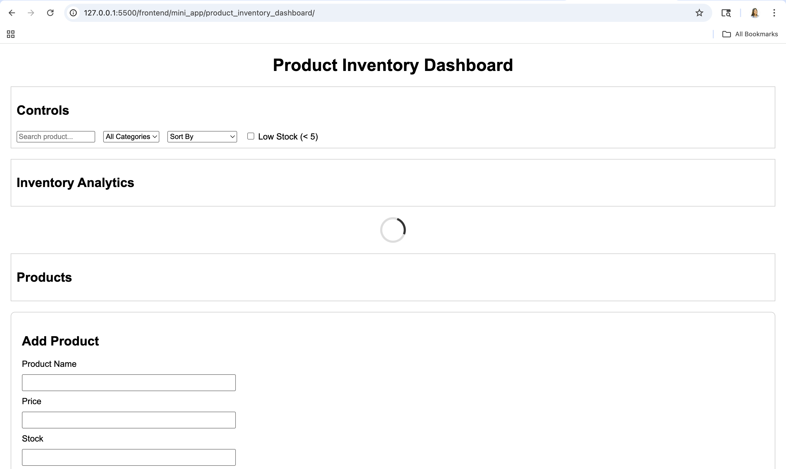

### No Products Found
Displays message when no products match the search or filters.
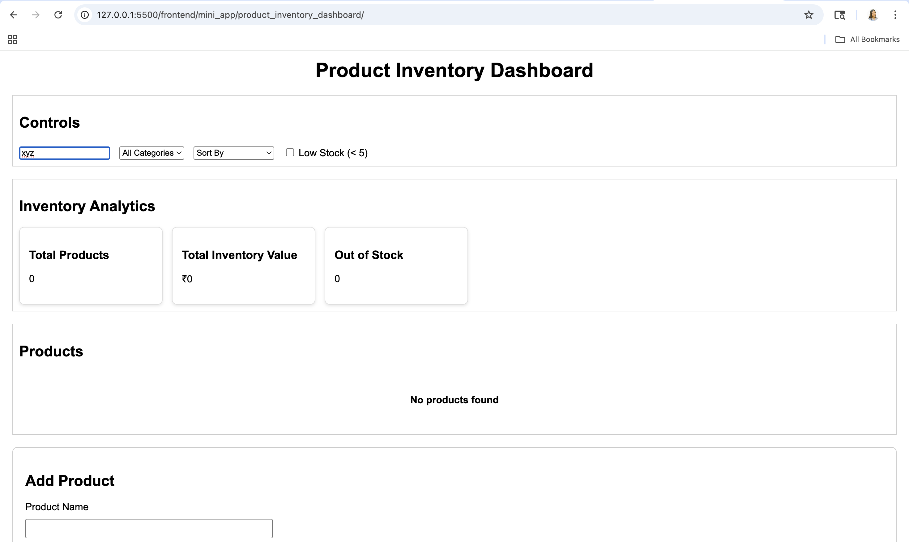

### Responsive View
Adapts layout for smaller screens and mobile devices.
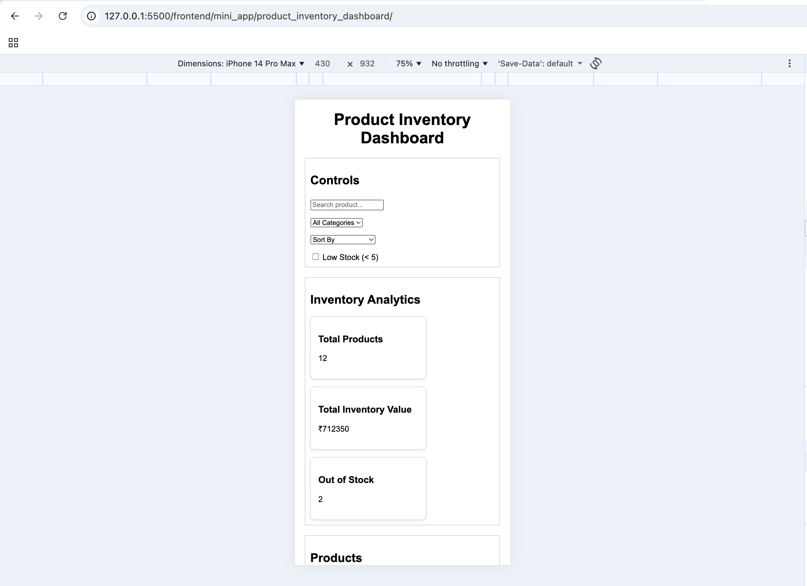

### Disabled Controls
Disables inputs and filters during loading for better UX.
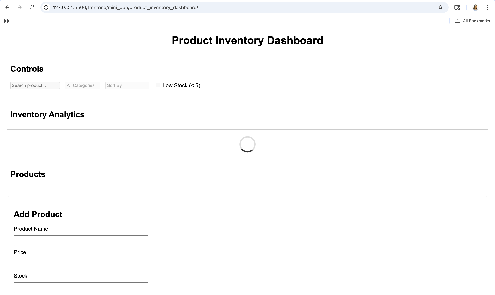

## Data Persistence Proof

### Local Storage Data
Displays product data stored in the browser as JSON format using Local Storage.
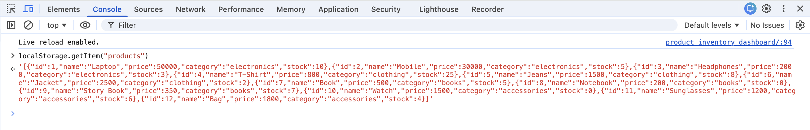

## Testing Checklist
- Add product → appears instantly
- Delete product → removed from UI and storage
- Search → real-time filtering
- Filters → correct results
- Sorting → correct order
- Refresh → data persists
- Loading → spinner visible

## Error Handling
- Handles empty product list
- Displays message when no products found
- Validates form inputs
- Prevents invalid data

## How to Run
- Clone the repository
- Open the project folder
- Run index.html in browser or Live Server

## Project Status
- ✔ All required features implemented
- ✔ Bonus features added
- ✔ Fully tested and working

## Future Improvements
- Add edit product functionality
- Implement pagination
- Integrate backend API

## Author
- Mahak Dhanotiya

